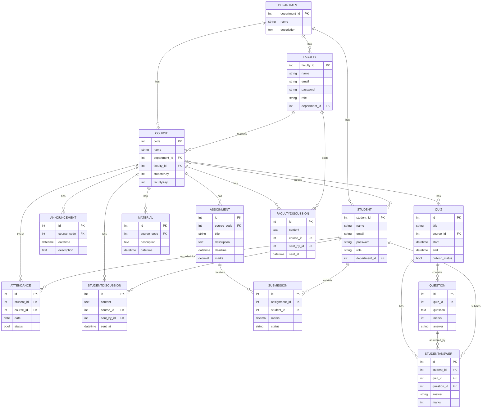

# AI-Centralized Learning Management System

A learning management and online assessment system for academic education, with AI-assisted quiz generation, content-based course/job recommendations, and an LMS-aware chatbot.

## Features

- Admin adds courses, teachers, and students and assigns them courses.
- The teacher creates course content, announcements, assignments, quizzes, takes attendance, etc. A teacher can see the details and analysis of the assessments.
- Students can enroll in courses using an access key, view content of enrolled courses, participate in assessments, and see their results in detail.
- Discussion section for both teacher and student.
- **AI Quiz Generator** — teachers paste in course material and get auto-generated multiple-choice questions, powered by a T5 model fine-tuned specifically for question generation (not a general-purpose LLM prompt).
- **Course Recommendations** — content-based recommender (TF-IDF + cosine similarity) suggesting courses based on a student's enrolled-course history and stated interests.
- **Smart Job Recommendations** — real-time job listings (via the Adzuna API) ranked against a student's profile using the same content-based similarity approach, with matched keywords shown per listing.
- **AI Chatbot** — an LMS-scoped assistant (Groq-hosted LLM) with conversation memory for the current session, presented as a collapsible floating widget available on every page.

## AI/ML Components

| Feature | Approach | Notes |
|---|---|---|
| Quiz Generator | Fine-tuned T5 (`t5-small`) for question generation, trained on SQuAD | Answer candidates extracted via spaCy NER/noun chunks; distractors drawn from other same-type entities in the passage. Training notebook: [`notebooks/t5_qg_finetuning.ipynb`](notebooks/t5_qg_finetuning.ipynb) |
| Course Recommendations | Content-based filtering: TF-IDF vectors + cosine similarity | Course profiles built from course name, department, and uploaded `Material` descriptions |
| Job Recommendations | TF-IDF + cosine similarity ranking over real Adzuna listings | Real-time job data, not model-generated |
| Chatbot | Groq-hosted LLM (`openai/gpt-oss-120b`) with an LMS-scoped system prompt | Conversation history kept client-side per browser tab (not persisted server-side) |

## Relational Schema



## Tech Stack

**Backend & Frontend**
- Django 4.0.4
- Bootstrap 5.0.2
- jQuery 3.6.0
- Chart.js v3.9.1
- Animate.css 4.1.1

**AI / ML**
- PyTorch + Hugging Face Transformers (fine-tuned T5 for question generation)
- scikit-learn (TF-IDF + cosine similarity recommenders)
- spaCy (`en_core_web_sm`) for answer/entity extraction
- Groq API (`openai/gpt-oss-120b`) for the chatbot

**External APIs**
- Adzuna (real-time job listings)

## Known Limitations

- **Quiz generator distractor quality** depends on how many distinct named entities are in the source passage — short or narrow passages can produce weak multiple-choice options. Longer, content-rich passages work best.
- **Adzuna's job data doesn't cover Pakistan** (or several other countries) — searches for unsupported locations currently return empty results rather than falling back to sample listings, since the fallback only triggers on network errors, not empty result sets.
- **`DEBUG = True` and `ALLOWED_HOSTS = ['*']`** are set for local development/demo purposes and are not production-safe defaults. Both are read from environment variables (`DEBUG`, `ALLOWED_HOSTS` in `.env`) so they can be overridden without touching source code, but the current `.env.example` values assume a local/demo environment, not deployment.
- **Course recommendation quality** depends on courses having `Material` entries with descriptive text — courses with no uploaded materials yield thin content profiles and are less likely to be recommended regardless of actual relevance.
- The chatbot's conversation memory is kept in browser `sessionStorage`, scoped to one browser tab — it is not saved server-side and does not persist across devices or after the tab is closed.

## Run Locally

1. Clone the project

```bash
git clone https://github.com/AsadUIIah/AI-Centralized-LMS.git
```

2. Go to the project directory

```bash
cd AI-Centralized-LMS
```

3. Create a virtual environment and activate it (Windows). **Python 3.11 or 3.12 is recommended** — very new Python versions (3.13+) may lack prebuilt wheels for some dependencies.

```bash
py -3.12 -m venv env
```

```bash
env\Scripts\activate
```

4. Install dependencies

```bash
pip install -r requirements.txt
```

> **Note:** On Python 3.10+, you may need the `--use-deprecated=legacy-resolver` option:

```bash
pip install -r requirements.txt --use-deprecated=legacy-resolver
```

5. Download the spaCy model used for quiz answer extraction

```bash
python -m spacy download en_core_web_sm
```

6. Set up your `.env` file in the project root (same folder as `manage.py`):

```
SECRET_KEY=your-django-secret-key
DEBUG=True
ALLOWED_HOSTS=*
GROQ_API_KEY=your-groq-api-key
ADZUNA_APP_ID=your-adzuna-app-id
ADZUNA_APP_KEY=your-adzuna-app-key
```

7. Add the fine-tuned quiz generator model. This repo does not include the model weights (too large for GitHub) — either train your own using [`notebooks/t5_qg_finetuning.ipynb`](notebooks/t5_qg_finetuning.ipynb) on Google Colab, then place the resulting files at `quiz/ml_models/t5-qg-finetuned/`.

8. Make migrations and migrate

```bash
python manage.py makemigrations
```

```bash
python manage.py migrate
```

9. Create admin/superuser

```bash
python manage.py createsuperuser
```

10. Finally, run the project

```bash
python manage.py runserver
```

Now the project should be running on http://127.0.0.1:8000/

Login as admin and add some courses, teachers, and students.

## License

[The MIT License (MIT)](https://github.com/AsadUIIah/AI-Centralized-LMS/blob/main/LICENSE)
